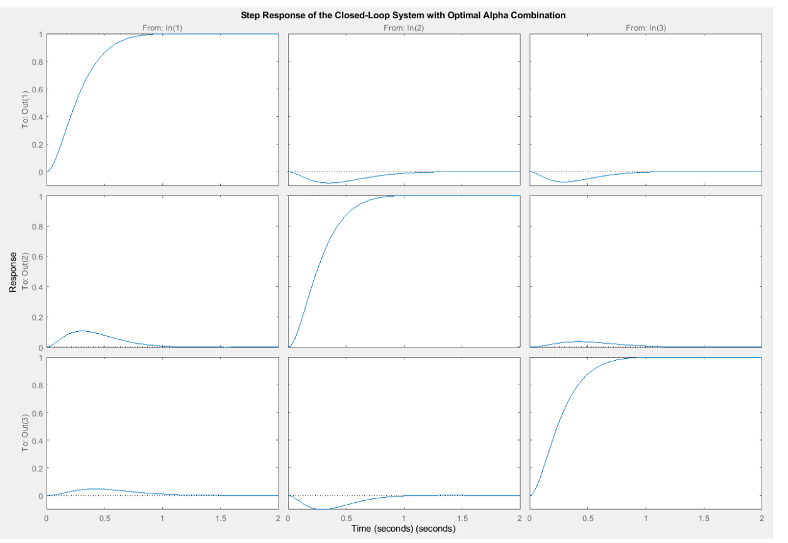
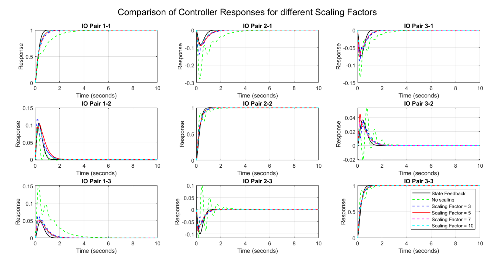
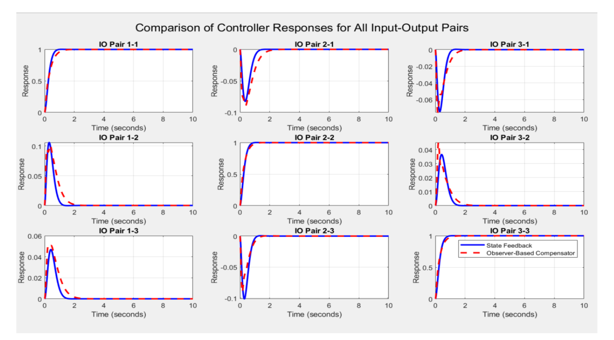

# 3-DOF Robotic Arm Control Design : Matlab

**Summary**

This project focuses on designing and implementing control strategies for a 3-DOF robotic arm, addressing the challenges of precision and stability in robotic motion. The system was modeled using kinematics and dynamics, with state-space analysis applied to design a state feedback controller with optimal pole placement and an observer-based compensator. Additionally, a Linear Quadratic Regulator (LQR) controller was used to achieve a balance between performance and energy efficiency. The objective was to achieve optimal dynamic response, including minimal overshoot, rapid settling time, and efficient control inputs. Through MATLAB simulations, the project demonstrates the effectiveness of advanced control techniques in achieving stable and accurate robotic arm movement.

**Key Skills Used**

* Kinematic and Dynamic Modeling
    
* State Feedback Control Design
    
* Observer-Based Compensator

* MATLAB Simulation
    

## Installation

**Prequisites**

* Matlab R2024 b 

* Control Systems Toolbox

## Demo

            Step Response of the closed loop system with optimal alpha values

            Comparision of controller responses for different scaling factors

                
            Comparision of controller response for all input-output pairs

